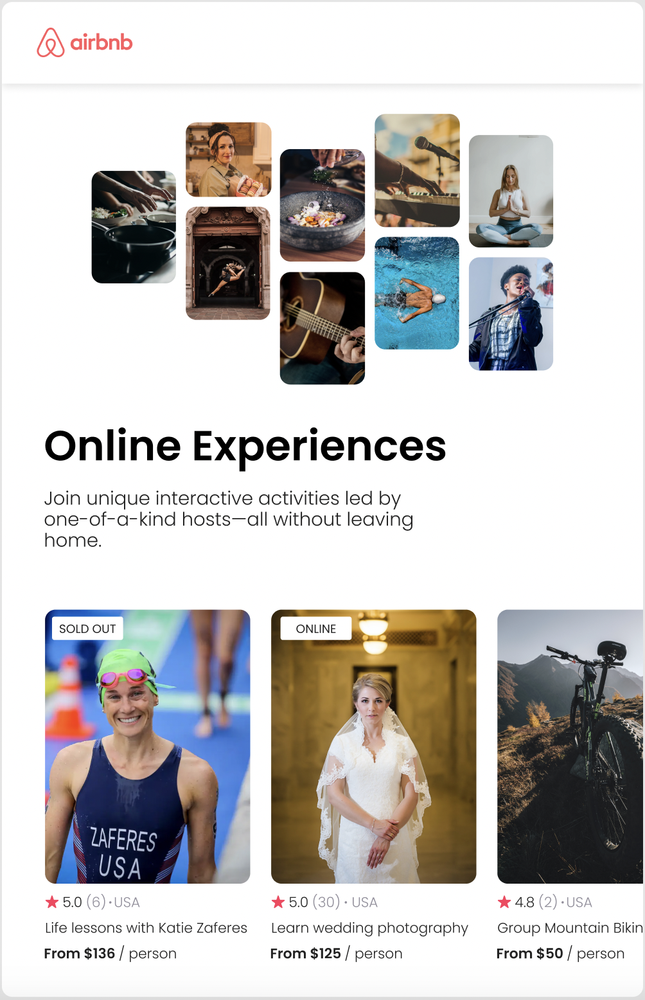

# Airbnb Clone

### Challenge: Data Driven React App

**Features**
- Reusable Components using Props
- Sharing Data between Components
- Reading data from JSON file
- Rendering Array of React Components using Arrays.map()

**App Design**

Design the two components as given in the figma design below - 

  
